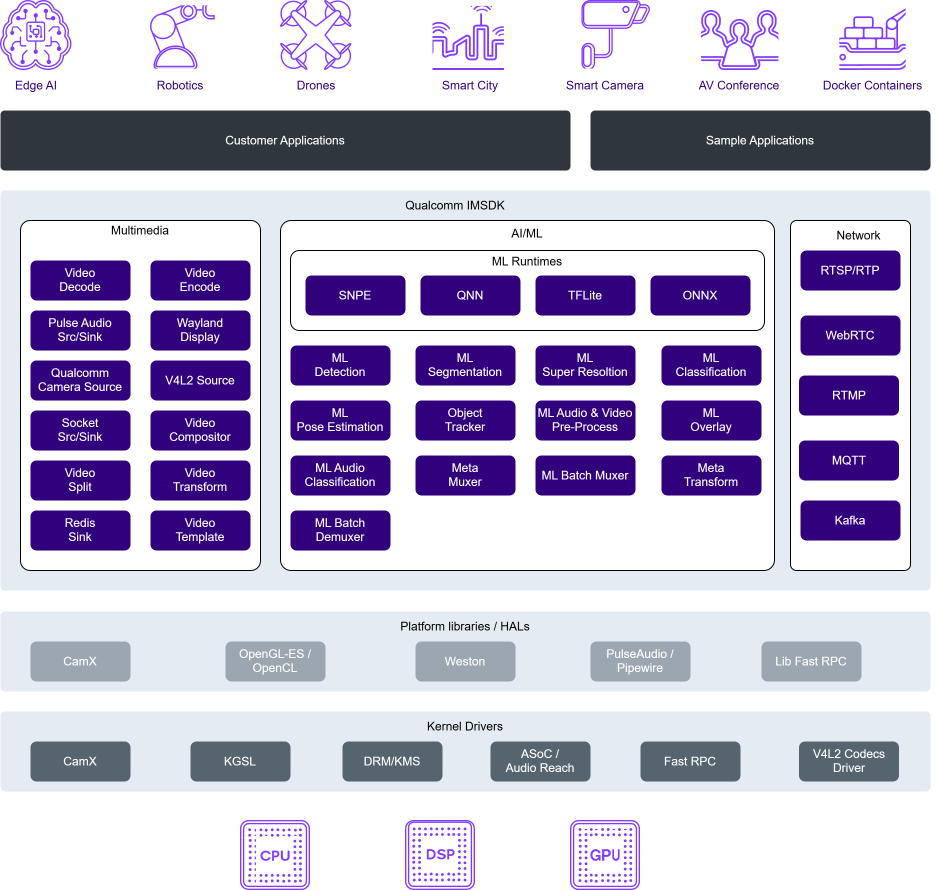

# Qualcomm IM SDK GStreamer Plugins

The QIM SDK encapsulates hardware complexity within a modular plugin architecture, freeing developers from the burden of managing low-level platform libraries or hardware-specific details that vary across Qualcomm chipsets and generations.

Each QIMSDK plugins in the SDK maps directly to a dedicated hardware accelerator — including video encode/decode, camera ISP, GPU, display, and AI/ML accelerators — giving developers a clean, unified API surface to build sophisticated multimedia and AI pipelines with minimal integration overhead.



## Compilation Instructions

### Download and install the toolchain

Follow the steps below to obtain the cross-compilation toolchain required to build this project.

1. Get the latest Nightly Build (**wrynose**) from the below link:

    [https://github.com/qualcomm-linux/meta-qcom/actions/workflows/nightly-build.yml](https://github.com/qualcomm-linux/meta-qcom/actions/workflows/nightly-build.yml)

1. Locate the **"build-nightly / publish_summary summary"** section within the workflow results.

1. Expand the **"Download URLs Details"** section to reveal the available build artifacts.

1. Under the **qcom-distro-sdk** distribution for the **qcom-armv8a** target, click on the **"Files"** link.

1. In the file list, use the **"Type"** filter to select `.sh` files, then download the following toolchain installer:
   ```
   qcom-distro-x86_64-qcom-multimedia-proprietary-image-armv8a-qcom-armv8a-toolchain-<version>.sh
   ```

1. Extract and install the toolchain.
    ```
    bash qcom-distro-x86_64-qcom-multimedia-proprietary-image-armv8a-qcom-armv8a-toolchain-*.sh -d <path_to_install_toolchain> -y
    ```
1. Source the cross-compilation toolchain environment.
    ```
    source <path_to_install_toolchain>/environment-setup-armv8a-qcom-linux
    ```

    > **Note:** This environment must be sourced for every new shell session before building the project.

### Download source code

Clone the source code from Github:

```
git clone https://github.com/qualcomm/qimsdk.git
cd qimsdk
```

### Build the source code

1. Compile base libraries.

    ```
    cmake -B build-base -S . \
    -DCMAKE_INSTALL_PREFIX=/usr \
    -DENABLE_GST_PLUGIN_BASE=1 \
    && cmake --build build-base
    ```

1. Install base libraries to SDK sysroot path.

    ```
    DESTDIR="${SDKTARGETSYSROOT}" cmake --install build-base --prefix /usr
    ```

1. Compile plugins and sample apps with updated base libraries.

    ```
    cmake -B build -S . \
    -DCMAKE_INSTALL_PREFIX=/usr \
    -DENABLE_GST_IMSDK_PLUGINS=1 \
    -DENABLE_GST_PLUGIN_MLTFLITE=1 \
    -DENABLE_GST_PYTHON_EXAMPLES=1 \
    -DENABLE_GST_SAMPLE_APPS=1 \
    -DENABLE_GST_SAMPLE_APPS_CAMERA=1 \
    -DENABLE_GST_PLUGIN_TOOLS=1 \
    -DENABLE_GST_CAMERA_PLUGINS=1 \
    -DENABLE_APP_BUILDER_CPP=1 \
    -DENABLE_APP_BUILDER_PYTHON=1 \
    && cmake --build build
    ```

## Resources

- [Qualcomm IM SDK Documentation](https://imsdkdocs.qualcomm.com)

## Development

Contributions are welcome! Please refer to the [CONTRIBUTING.md](CONTRIBUTING.md) file for full details on how to contribute to this project, including:

- [Branching strategy](CONTRIBUTING.md#branching-strategy)
- [Submitting a pull request](CONTRIBUTING.md#submitting-a-pull-request)

## License

gst-plugins-imsdk is licensed under the [BSD-3-Clause-Clear License](https://spdx.org/licenses/BSD-3-Clause-Clear.html). See [LICENSE.txt](LICENSE.txt) for the full license text.
